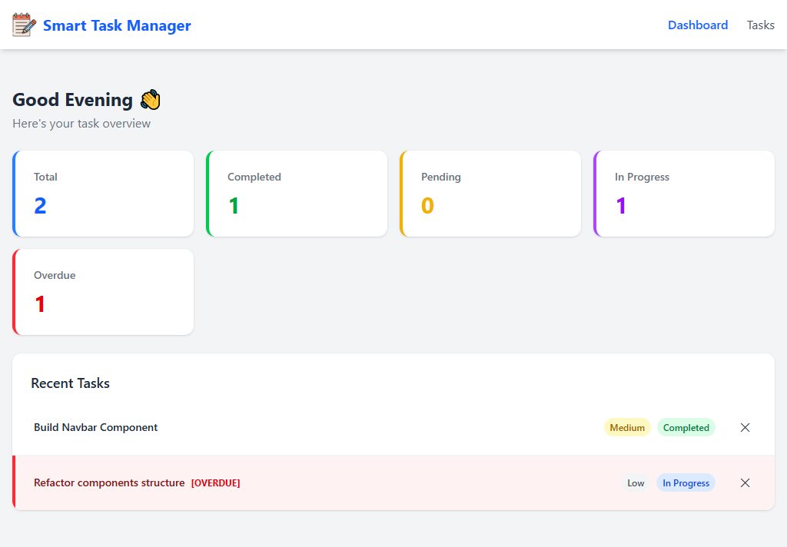
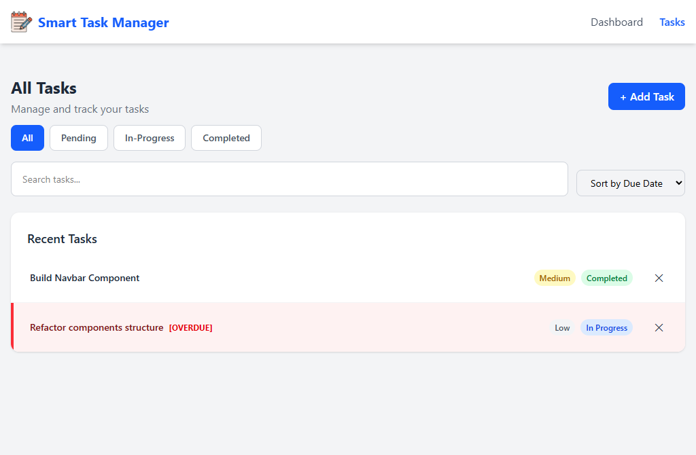
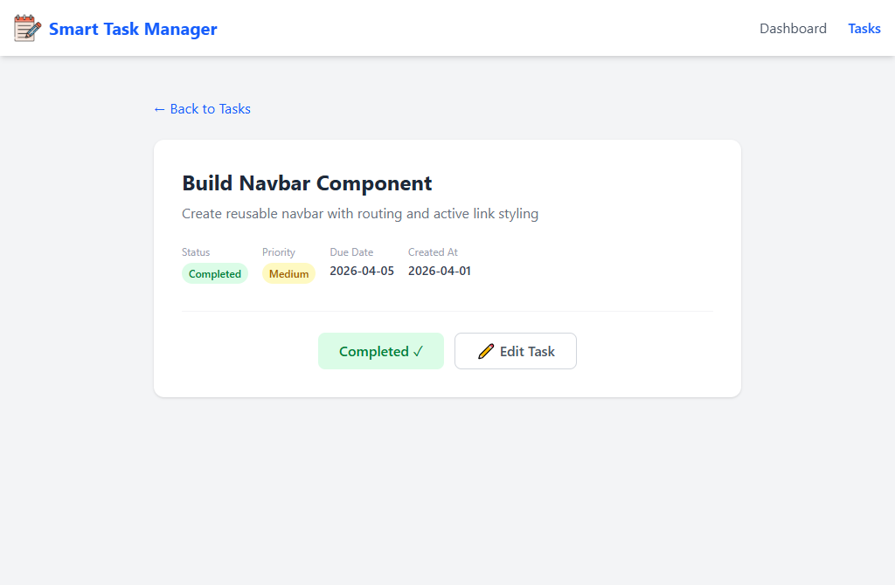
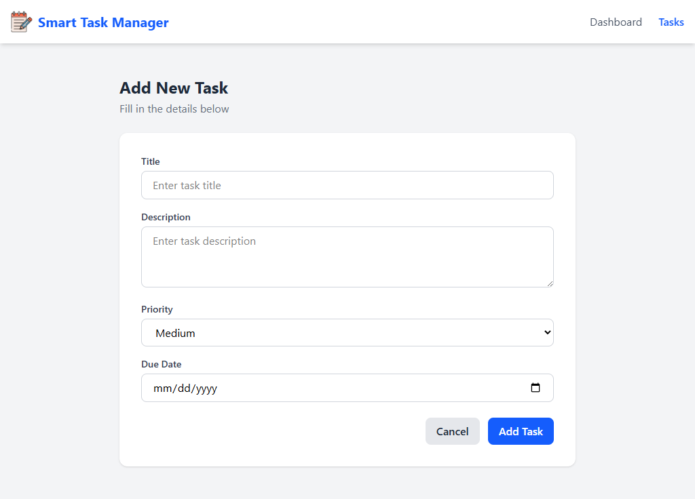
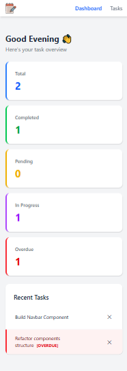

# 📋 Smart Task Manager

A modern task management application built with React and Vite, featuring intelligent task organization, real-time filtering, and persistent storage.

🔗 **Live Demo:** [smart-task-manager-eta-three.vercel.app](https://smart-task-manager-eta-three.vercel.app/)

---

## ✨ Features

### 📝 Task Management

- Create new tasks with title, description, due date, and priority level
- Edit existing tasks with full update capability
- Delete tasks with confirmation and undo functionality
- Mark tasks as pending, in-progress, or completed
- Due date tracking with overdue task highlighting
- Task priority levels (Low, Medium, High, Urgent)
- Task detail view for comprehensive information
- Empty state handling for better UX

### 🔍 Search & Filtering

- Full-text search by task title and description
- Filter tasks by status (Pending, In Progress, Completed)
- Real-time search results with instant updates
- Combine search with status filters for advanced queries
- Clear filters with one click
- Visual feedback for active filters

### 📊 Dashboard & Analytics

- Task statistics overview (total, pending, in-progress, completed)
- Task count indicators for quick status check
- Progress tracking across all tasks
- Status distribution visualization
- Quick action buttons for common tasks
- Summary cards for key metrics

### 🔄 Undo & Recovery

- One-click undo for deleted tasks
- Undo status changes
- Toast notifications with undo action buttons
- 30-second undo window (configurable)
- Smart undo history management
- Clear visual confirmation of actions

### 💾 Data Persistence

- Automatic data save using localStorage
- Data persists across browser sessions
- No data loss on page refresh
- Efficient storage management
- Automatic sync to localStorage on every update

### 🎨 Dynamic UI Features

- Color-coded priority badges (Low, Medium, High, Urgent)
- Status-based visual indicators
- Task list with cards showing essential info
- Responsive grid layouts
- Loading states during operations
- Empty state illustrations
- Visual task overdue indicators

### 🌅 Layout & Navigation

- Sticky navigation bar with branding
- Responsive sidebar navigation
- Breadcrumb navigation for context
- Quick navigation buttons
- Mobile-friendly menu structure
- Organized page routing

### 📱 Responsive Design

- Mobile-first approach with Tailwind CSS v4
- Touch-friendly button sizing
- Responsive font scaling (text-sm → text-lg on larger screens)
- Flexible card layouts (stack on mobile, grid on desktop)
- Optimized spacing for all screen sizes
- Readable text on all devices

### ⚡ Performance & Optimization

- Custom React hooks for centralized logic (`useTaskStats`)
- useMemo for expensive calculations
- useCallback for stable function references
- Lazy useState initializer for initial data load
- Efficient re-renders with React 19
- Optimized component structure
- Context API for state management without prop drilling

### 🛡️ Error Handling & Validation

- Form validation on task creation/editing
- Required field validation
- Error messages for invalid inputs
- Graceful error handling for storage failures
- User-friendly error notifications
- Recovery suggestions in error states

### ♿ Accessibility

- Semantic HTML structure
- ARIA labels on interactive elements
- Keyboard navigation support
- Clear focus states on buttons
- High contrast text and backgrounds
- Alt text for icons
- Clear status and priority indicators

---

## 🛠️ Built With

- **React 19.2.4** — Modern UI framework with hooks
- **Vite** — Fast build tool and development server
- **Tailwind CSS v4** — Utility-first CSS for responsive design
- **React Router v7** — Client-side routing
- **Context API** — State management
- **localStorage API** — Persistent data storage
- **PropTypes** — Runtime type checking

---

## 📁 Project Structure

<details>
<summary><strong>Click to expand</strong></summary>

```plaintext
src/
├── components/
│   ├── layout/
│   │   ├── MainLayout.jsx      # Main app layout wrapper
│   │   └── Navbar.jsx          # Navigation bar component
│   └── ui/
│       ├── Badge.jsx           # Status/priority badge component
│       ├── Button.jsx          # Reusable button component
│       ├── EmptyState.jsx      # Empty state placeholder
│       ├── Spinner.jsx         # Loading spinner
│       ├── StatCard.jsx        # Statistics card display
│       ├── TaskForm.jsx        # Task creation/edit form
│       ├── TaskList.jsx        # Task listing component
│       └── Toast.jsx           # Notification toast
├── context/
│   └── TaskContext.jsx         # Global task state & actions
├── hooks/
│   └── useTaskStats.js         # Task statistics calculation hook
├── pages/
│   ├── Dashboard.jsx           # Main dashboard page
│   ├── Tasks.jsx               # Tasks listing page
│   ├── TaskDetail.jsx          # Individual task detail page
│   ├── AddTask.jsx             # Task creation page
│   ├── EditTask.jsx            # Task editing page
│   └── NotFound.jsx            # 404 not found page
├── services/
│   └── taskService.js          # Task business logic & localStorage
├── constants/
│   └── index.js                # App constants (status, priority, etc.)
├── App.jsx                     # Main app component with routing
├── index.css                   # Global styles
└── main.jsx                    # React entry point
```

</details>

---

## 🚀 Getting Started

### Prerequisites

- Node.js 18+
- npm or yarn package manager

### Installation

```bash
# Clone the repository
git clone https://github.com/yourusername/smart-task-manager.git

# Navigate to the project folder
cd smart-task-manager

# Install dependencies
npm install

# Start the development server
npm run dev
```

### Build for production

```bash
npm run build
```

### Preview production build

```bash
npm run preview
```

---

## 🔧 Available Scripts

- `npm run dev` — Start Vite development server
- `npm run build` — Build production bundle with minification
- `npm run preview` — Preview production build locally
- `npm run lint` — Run ESLint for code quality

---

## 🧠 Key Concepts & Architecture

### State Management

- **Context API** for centralized task state management
- **TaskContext** provider wrapping the entire application
- Efficient state updates with reducer-like pattern
- No prop drilling across component hierarchy

### Custom Hooks

- **`useTaskStats`** — Calculates task statistics (total, completed, pending, in-progress)
- Memoized calculations for performance optimization
- Returns stats object with count data

### Service Layer

- **`taskService.js`** — Encapsulates task operations:
  - `getTasks()` - Retrieve all tasks from localStorage
  - `addTask()` - Create new task
  - `updateTask()` - Modify existing task
  - `deleteTask()` - Remove task
  - `searchTasks()` - Filter tasks by text
  - `filterByStatus()` - Filter by status type
  - `sortByDueDate()` - Sort task chronologically

### Component Architecture

- **Layout Components** — Navbar, MainLayout for consistent structure
- **UI Components** — Reusable Button, Badge, StatCard components
- **Page Components** — Full-page views (Dashboard, Tasks, AddTask, etc.)
- **Form Components** — TaskForm for creation and editing with validation

### Performance Optimization

- `React.useMemo` — Prevent unnecessary calculations
- `React.useCallback` — Stable function references
- Lazy useState initializer — Defer initial state computation
- Component memoization — Prevent unnecessary re-renders

### Data Persistence

- localStorage automatically saves task changes
- Sync across browser tabs/windows
- Recovery from accidental deletions with undo feature
- Efficient data serialization/deserialization

---

## 📸 Screenshots

### Dashboard — Overview & Quick Stats

Task statistics at a glance with recent activity and quick action buttons

<br/><br/>

### Tasks List — Comprehensive View

Complete task listing with search, filters, and sorting options

<br/><br/>

### Task Detail — Full Information

Detailed view of individual task with all metadata and action options

<br/><br/>

### Add/Edit Task — Form Interface

Task creation and editing form with validation and priority selection

<br/><br/>

### Responsive Design — Mobile View

Mobile-optimized layout with touch-friendly navigation and controls


---

## 💡 Usage Guide

### Creating a Task

1. Navigate to **Add Task** page via navbar
2. Fill in task title (required) and description (optional)
3. Set due date for task scheduling
4. Select priority level (Low, Medium, High, Urgent)
5. Click **Add Task** to save

### Managing Tasks

1. View all tasks on **Tasks** page
2. Use search bar to find tasks by title or description
3. Filter by status using status buttons
4. Click on any task to view full details
5. Edit or delete tasks from detail or list view

### Tracking Progress

1. Monitor statistics on **Dashboard** page
2. Check task counts by status
3. View upcoming tasks by due date
4. Use filters to focus on specific task groups

### Undoing Actions

1. After deleting or changing task status, a toast notification appears
2. Click **Undo** button in toast to reverse the action
3. Undo is available for 30 seconds after action

---

## 📝 License

MIT License

_Built as a portfolio project to showcase React, Vite, Context API, localStorage persistence, form handling, and responsive design with Tailwind CSS._

---

## 🤝 Contributing

Contributions, issues, and feature requests are welcome! Feel free to check the [issues page](https://github.com/yourusername/smart-task-manager/issues).

---

## 👨‍💻 Author

Built with ❤️ by [Your Name]

---

## 🙏 Acknowledgments

- [React Documentation](https://react.dev)
- [Tailwind CSS](https://tailwindcss.com)
- [Vite Guide](https://vitejs.dev)

---

Made with ❤️ by Bilal Ahmed
